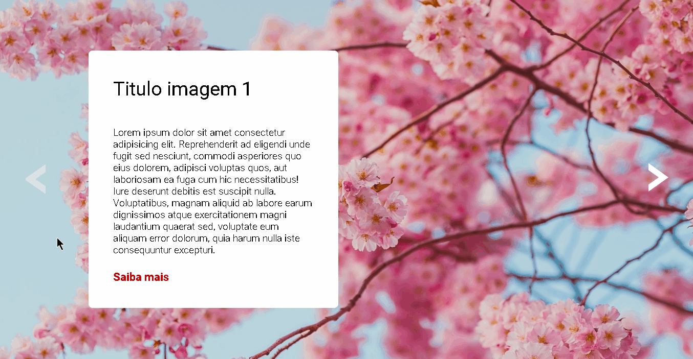

# Projeto Carousel
Projeto de um carousel de imagens, que troca tanto as imagens quanto a seção de texto.

## 🔗 Acesso ao projeto

## 🛠 Skils

 
  
  
  

## 📤 Feedback
Se você tiver algum feedback, entre em contato comigo em jhony00._@hotmail.com
